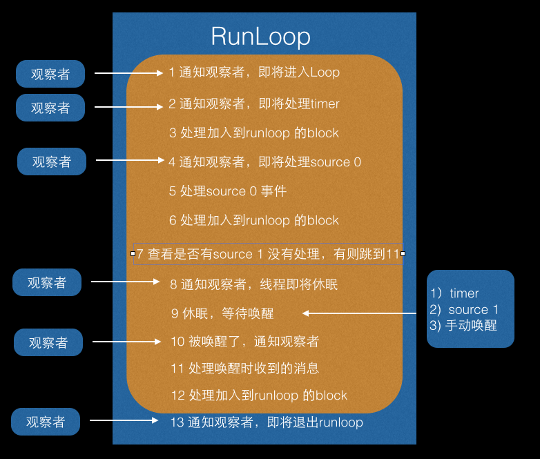

##RunLoopRun 源码解析

一开始，先看一下图吧，别太紧张。[源码地址](https://github.com/vedon/CF/blob/master/CFRunLoop.c)



好啦，紧接着下面源码对应的就是这个图的逻辑。

```
static int32_t __CFRunLoopRun(CFRunLoopRef rl, CFRunLoopModeRef rlm, CFTimeInterval seconds, Boolean stopAfterHandle, CFRunLoopModeRef previousMode) {
    
    //1.判断一下RunLoop 是否停止了，停止则启动runloop.
    
    //2.启动一个source 来检测runloop 是否超时，超时则唤醒runloop.
    
    //标志是否有需要在GCD 执行的操作
    Boolean didDispatchPortLastTime = true;
    int32_t retVal = 0;
    do {
        //3.通知 Observers: RunLoop 即将触发 Timer 回调
        if (rlm->_observerMask & kCFRunLoopBeforeTimers) __CFRunLoopDoObservers(rl, rlm, kCFRunLoopBeforeTimers);
        
        //4.通知 Observers: RunLoop 即将触发 Source0 (非port) 回调。
        if (rlm->_observerMask & kCFRunLoopBeforeSources) __CFRunLoopDoObservers(rl, rlm, kCFRunLoopBeforeSources);
        
        //执行哪些加入到当前runloop的block. e.g :CFRunLoopPerformBlock(<#CFRunLoopRef rl#>, <#CFTypeRef mode#>, <#^(void)block#>)
        __CFRunLoopDoBlocks(rl, rlm);
        
        
        //5.RunLoop 触发 Source0 (非port) 回调。
        Boolean sourceHandledThisLoop = __CFRunLoopDoSources0(rl, rlm, stopAfterHandle);
        if (sourceHandledThisLoop) {
        //6.执行哪些加入到当前runloop的block. 
            __CFRunLoopDoBlocks(rl, rlm);
        }
        
        Boolean poll = sourceHandledThisLoop || (0ULL == timeout_context->termTSR);
        
        //7.判断当前的port 不为空，而且没有触发过dispatchPort 里面的事件，如果有 Source1 (基于port) 处于 ready 状态，直接处理这个 Source1 然后跳转去处理消息。
        
        if (MACH_PORT_NULL != dispatchPort && !didDispatchPortLastTime) {
            msg = (mach_msg_header_t *)msg_buffer;
            if (__CFRunLoopServiceMachPort(dispatchPort, &msg, sizeof(msg_buffer), &livePort, 0, &voucherState, NULL)) {
                goto handle_msg;
            }
        }
        didDispatchPortLastTime = false;
               
        //8.通知 Observers: RunLoop 的线程即将进入休眠(sleep)。
        if (!poll && (rlm->_observerMask & kCFRunLoopBeforeWaiting)) __CFRunLoopDoObservers(rl, rlm, kCFRunLoopBeforeWaiting);
       
        
        /*
         9.调用 mach_msg 等待接受 mach_port 的消息。线程将进入休眠, 直到被下面某一个事件唤醒
        1)一个基于 port 的Source 的事件。
        2)一个 Timer 到时间了
        3) RunLoop 自身的超时时间到了
        4)被其他什么调用者手动唤醒
        */
        __CFRunLoopServiceMachPort(waitSet, &msg, sizeof(msg_buffer), &livePort, poll ? 0 : TIMEOUT_INFINITY, &voucherState, &voucherCopy);
        
        
        //10. 通知 Observers: RunLoop 的线程刚刚被唤醒了。
        __CFRunLoopUnsetSleeping(rl);
        if (!poll && (rlm->_observerMask & kCFRunLoopAfterWaiting)) __CFRunLoopDoObservers(rl, rlm, kCFRunLoopAfterWaiting);
        
        handle_msg:;
        
        //11.处理消息
        __CFRunLoopSetIgnoreWakeUps(rl);
        if (MACH_PORT_NULL == livePort) {
            CFRUNLOOP_WAKEUP_FOR_NOTHING();
            // handle nothing
        } else if (livePort == rl->_wakeUpPort) {
            CFRUNLOOP_WAKEUP_FOR_WAKEUP();
            // do nothing on Mac OS
        }
        else if (rlm->_timerPort != MACH_PORT_NULL && livePort == rlm->_timerPort) {
            
            //如果一个 Timer 到时间了，触发这个Timer的回调。
            CFRUNLOOP_WAKEUP_FOR_TIMER();
            if (!__CFRunLoopDoTimers(rl, rlm, mach_absolute_time())) {
                __CFArmNextTimerInMode(rlm, rl);
            }
        }
        else if (livePort == dispatchPort) {
            
            // 如果有dispatch到main_queue的block，执行block。
            CFRUNLOOP_WAKEUP_FOR_DISPATCH();
            __CFRUNLOOP_IS_SERVICING_THE_MAIN_DISPATCH_QUEUE__(msg);
            _CFSetTSD(__CFTSDKeyIsInGCDMainQ, (void *)0, NULL);
            sourceHandledThisLoop = true;
            didDispatchPortLastTime = true;
        } else {
            CFRUNLOOP_WAKEUP_FOR_SOURCE();
         
            //如果一个 Source1发出事件了，处理这个事件
            CFRunLoopSourceRef rls = __CFRunLoopModeFindSourceForMachPort(rl, rlm, livePort);
            if (rls) {
                sourceHandledThisLoop = __CFRunLoopDoSource1(rl, rlm, rls, msg, msg->msgh_size, &reply) || sourceHandledThisLoop;
            }
            
        }
        //12.执行哪些加入到当前runloop的block. 
        __CFRunLoopDoBlocks(rl, rlm);
        if (sourceHandledThisLoop && stopAfterHandle) {
            
            //进入loop时参数说处理完事件就返回
            retVal = kCFRunLoopRunHandledSource;
        } else if (timeout_context->termTSR < mach_absolute_time()) {
            
            //Runloop 超时le
            retVal = kCFRunLoopRunTimedOut;
        } else if (__CFRunLoopIsStopped(rl)) {
            //被外部干掉了
            retVal = kCFRunLoopRunStopped;
        } else if (rlm->_stopped) {
            //被外部干掉了
            retVal = kCFRunLoopRunStopped;
        } else if (__CFRunLoopModeIsEmpty(rl, rlm, previousMode)) {
            
            // source/timer/observer一个都没有了
            retVal = kCFRunLoopRunFinished;
        }
        
    } while (0 == retVal);
    
    if (timeout_timer) {
        dispatch_source_cancel(timeout_timer);
        dispatch_release(timeout_timer);
    } else {
        free(timeout_context);
    }
    
    //13.通知观察者，runloop 要退出了。
    return retVal;
}
```

 
##源码太枯燥无味了，直接说原理。

简单从一个点击时间开始分析。

> *系统注册了一个基于port 的source ，回调函数为__IOHIDEventSystemClientQueueCallback。通过测试，无论你点击屏幕，甚至是你晃动手机，都是触发这个回调。

> *经查资料知道这首先由 IOKit.framework 生成一个 IOHIDEvent 事件并由 SpringBoard 接收，随后用 mach port 转发给需要的App进程。随后苹果注册的那个 Source1 就会触发回调，并调用 _UIApplicationHandleEventQueue() 进行应用内部的分发。

> *_UIApplicationHandleEventQueue() 会把 IOHIDEvent 处理并包装成 UIEvent 进行处理或分发，其中包括识别 UIGesture/处理屏幕旋转/发送给 UIWindow 等。

下面是一些点击button 的调用log
点击一个button

```
__CFRunLoopDoObservers (刚从休眠中唤醒)
__CFRunLoopDoSource1
__CFRUNLOOP_IS_CALLING_OUT_TO_A_SOURCE1_PERFORM_FUNCTION__
__IOHIDEventSystemClientQueueCallback
__CFRunLoopDoBlocks
__CFRunLoopDoObservers (即将处理 Timer)
__CFRunLoopDoObservers (即将处理 Source)
__CFRunLoopDoBlocks
__CFRunLoopDoSource0 (__CFRUNLOOP_IS_CALLING_OUT_TO_A_SOURCE0_PERFORM_FUNCTION__)
_UIApplicationHandleEventQueue
__CFRunLoopDoBlocks
__CFRunLoopDoBlocks
```

接着说说GCD
实际上 RunLoop 底层也会用到 GCD 的东西，比如 RunLoop 是用 dispatch_source_t 实现的 Timer。但同时 GCD 提供的某些接口也用到了 RunLoop， 例如 dispatch_async()。

调用的log:

```
__CFRunLoopDoObservers (即将处理 Timer)
__CFRunLoopDoObservers (即将处理 Source)
__CFRunLoopDoBlocks
__CFRunLoopDoObservers (即将进入休眠)
__CFRunLoopDoObservers (刚从休眠中唤醒)
__CFRUNLOOP_IS_SERVICING_THE_MAIN_DISPATCH_QUEUE__
```

当调用 dispatch_async(dispatch_get_main_queue(), block) 时，libDispatch 会向主线程的 RunLoop 发送消息，RunLoop会被唤醒，并从消息中取得这个 block，并在回调 __CFRUNLOOP_IS_SERVICING_THE_MAIN_DISPATCH_QUEUE__() 里执行这个 block。但这个逻辑仅限于 dispatch 到主线程，dispatch 到其他线程仍然是由 libDispatch 处理的。

从这里可以看到，每一次执行完工作后，主线程都会进入休眠，等待唤醒。这个时候，可以把一些必须要在主线程执行的，而又不需要马上显示出来的工作在这个时候触发。这个时机，可以通过runloop 的observer 来实现。

```
- (void)createRunLoopObserverWithObserverType:(CFOptionFlags)flag
{
    CFRunLoopRef runLoop = CFRunLoopGetCurrent();
    CFStringRef runLoopMode = kCFRunLoopDefaultMode;
    CFRunLoopObserverRef observer = CFRunLoopObserverCreateWithHandler
    (kCFAllocatorDefault, flag, true, 0, ^(CFRunLoopObserverRef observer, CFRunLoopActivity _activity) {
        
        switch (_activity) {
            case kCFRunLoopEntry:
            {
                NSLog(@"即将进入Loop");
            }
                break;
            case kCFRunLoopBeforeTimers:
                NSLog(@"即将处理 Timer");
                break;
            case kCFRunLoopBeforeSources:
                NSLog(@"即将处理 Source");
                break;
            case kCFRunLoopBeforeWaiting:
                NSLog(@"即将进入休眠");
                ;
                break;
            case kCFRunLoopAfterWaiting:
                NSLog(@"刚从休眠中唤醒");
                break;
            case kCFRunLoopExit:
                NSLog(@"即将退出Loop");
                break;
            default:
                break;
        }
    });
    CFRunLoopAddObserver(runLoop, observer, runLoopMode);
}
```

flag 传入kCFRunLoopBeforeWaiting。执行操作的时候使用

```
[self performSelector:@selector(performAction) onThread:[NSThread mainThread] withObject:nil waitUntilDone:NO modes:@[NSDefaultRunLoopMode]];
```

传入一个source 0 事件到当前runloop ，把它唤醒。设置NSDefaultRunLoopMode ，让用户在操作tableView 的时候，runloop 切换到 UITrackingMode ，暂停传入的source 0 事件。这样，至少可以提升一下用户体验。
