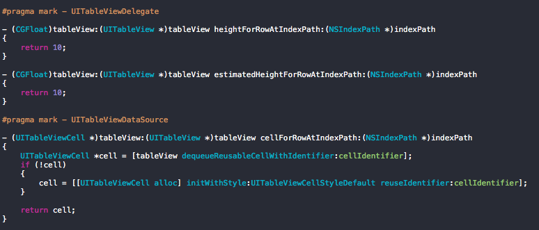
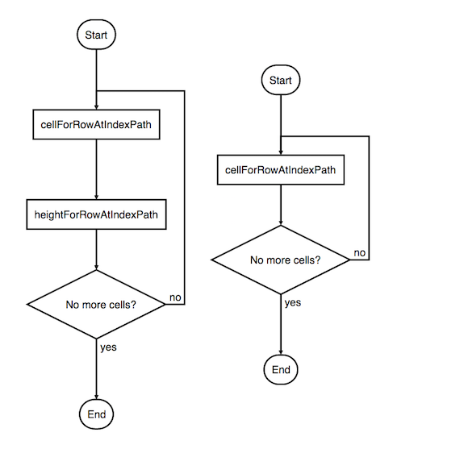
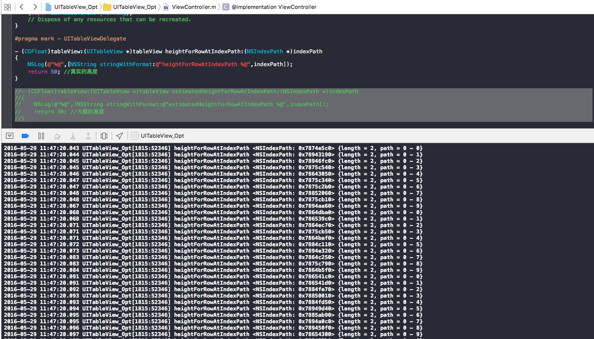
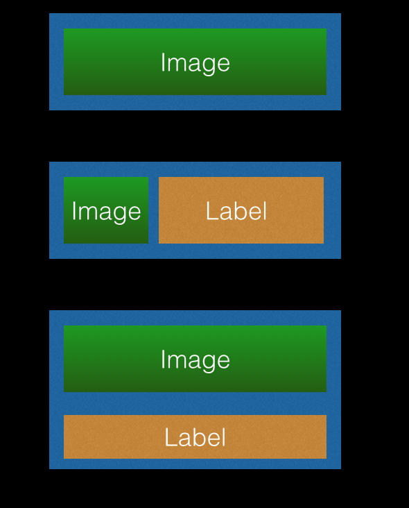
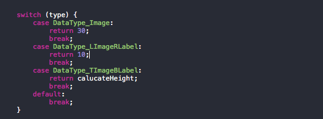
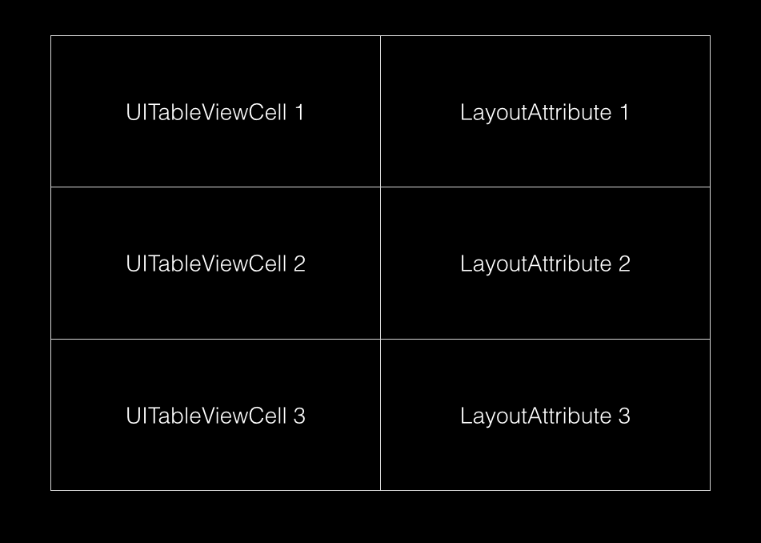

#UITableview Tip

## 1) delegate 和 dataSource 回调时机

在做自媒体人卡片的时候，发现在 iOS 7 和 iOS 8 之后的UITableView 的事件回调机制很不一样，于是踩坑了！
关心的主要回调事件主要有：

####这几个函数调用的时机主要有：
>1) 调用addSubView方法将UITableView 加入到父视图。
>
>2）TableView 调用 reloadData 方法。
>
>3）滚动TableView。

####在 iOS 7 上，把TableView 加入到父视图实行的方法时序如下：

可以发现，系统会在获取每行的cell前，前置拿到所有行的高度。这样，系统才能计算出滚动轴的总高度。而之后在获取cell对象时，并不会重新调用获取该行高度的方法。

####在 iOS 8 上，把TableView 加入到父视图实行的方法时序如下：

在iOS 7.0上，可以发现，系统会在获取每行的cell前，前置拿到所有行的高度。之后，在获取cell对象时，并不会重新调用获取该行高度的方法。而在iOS 8.0上，在获取cell对象后，会重新调用获取该行高度的方法。这样，就意味着可以在真正产生出cell对象之后，再提供高度。

**这里也是我猜坑的地方，在iOS 7 计算高度的地方，由于在 7 上前置拿到所有cell 高度之后，后面不会再调用heightForRowAtIndexPath 这个方法，导致高度计算出错，解决的办法就是在返回高度的地方强制SetNeedLayout才能获取对的高度！**

在这里，聪明的杀破狼队员们应该发现：什么，在iOS 8 之后，调用cellForRowAtIndexPath 的地方会再调用一次heightForRowAtIndexPath ！ 每次都计算高度，很浪费呀。

左边是iOS 8 ，右边是iOS 7

正是因为这个区别，有时候我们发现同样的代码，在 iPhone5 （iOS 7 系统） 比 iPhone 5s （iOS 8 系统）还流畅！WTF

解决的办法是：**Cache it !** 别忘了，横屏和竖屏的高度是不一样的，要分开缓存！不然，测试兄弟又提Bugs 了。

####heightForRowAtIndexPath 调用次数，在iOS 7 也受estimatedHeightForRowAtIndexPath 函数的影响。

**有图有真相！**

当使用estimatedHeightForRowAtIndexPath 的时候，系统只会调用heightForRowAtIndexPath。

当没有使用estimatedHeightForRowAtIndexPath 的时候，系统只会调用heightForRowAtIndexPath。

**通过结果可以看到，加载时会先通过 estimatedHeightForRowAtIndexPath 处理全部数据，此时只需要返回一个粗略的高度，待到Cell加载时才去调用原有的真实高度的回调方法，且只会处理屏幕范围内的行，这样当数据非常多时，会显著的提升加载的性能**

##2）让高度计算不再成为负担

基于这些TableView 的特点，在设置cell 的时候，是否可以提前异步计算每一个cell 的高度，然后缓存起来呢？
这不是废话吗？肯定可以啦！

有三种类型的cell ，如下图

假设注册了三种类型的cell，第一，第二种cell 的高度是固定的。第三种cell 的高度根据底部label 的高度变化而变化。聪明的你一定会想到，根据数据的类型，返回对应的高度就可以啦。对于第三种类型，计算文字的高度再返回。So far so good!

代码大概长这个样子：

过几天，UI 觉得不好看，改一下UI 把。

一次两次的改动，修改是很快的。当业务越来越复杂的时候，cell 的类型越来越多的时候，一些layout 的代码也变得很难看。我的解决办法是：通过为每一种cell 配置一个专门用于保存配置信息的类。LayoutoutAttribute.通过layoutAttribute ,可以知道类型1 的cell ，它主要就是图片的上下左右边距的调整，通过设置layoutAttribute ，返回对应UIEdgeInsets 。这样就可以了，不用再修改layoutSubView 里面的代码。多爽！

结合Cell的数据，生成对应的LayoutAttribute 就可以确定对应的Cell的 高度！简单一句就是：TableView的数据有了，高度也就有了。这里可以异步的计算高度，具体怎么做，你懂的啦！

