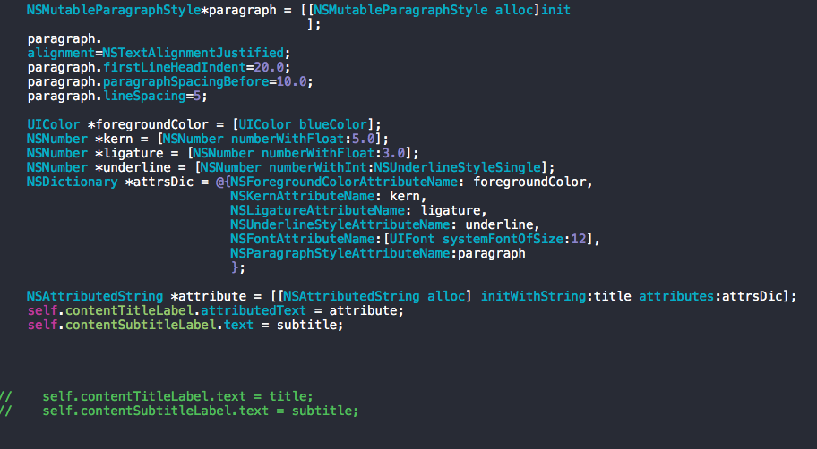
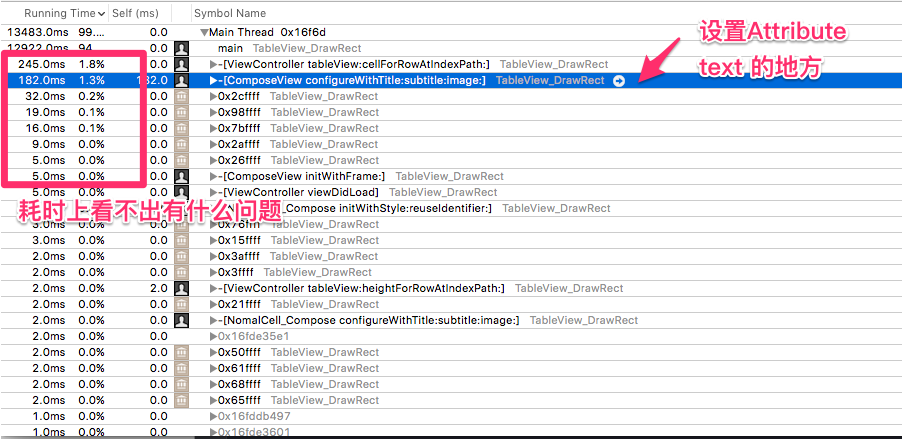

#UITableview Tip

##1）CPU消耗的时间低，不代表tableView 滚动的帧率就会高

NSAttributedString 对帧率的影响，一开始认为它对帧率的影响应该是很小的，但是经过测试发现->Holy shit, 原来它是这么屌的。

Demo 中的代码主要差别就是这几行代码。

使用NSAttributedString 来对label 的字体设值，帧率会下降到30帧左右。而通过label 的Text设值。帧率会保持在58左右。来看看CPU Usage，看看可以查出有什么函数特别耗时。

再来对比一下label  的setText 

从图片中可以看到setText 的耗时比Attribute Text的耗时更长，但是帧率却赢它几条街。

从CPU 利用率的曲线上看，可以发现问题。

CPU 总的利用率太高了。NSAttributeString  在CPU 上进行渲染了。把整个CPU 的利用率提上去了，因此影响了滚动的帧率。定位到问题了，那么解决办法是？

#自己画吧

